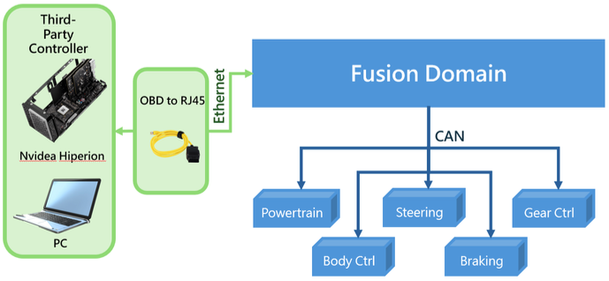
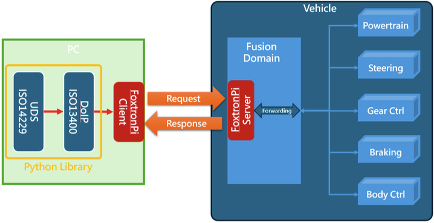

# 2. 系統架構

## 2.1 FoxtronPi 系統硬體架構
FoxtronPi 是建構於鴻華 Model C 車型上的控制軟體，主要負責建立車輛與外部控制器之間的通訊連線，並將外部控制器所下達的命令進行訊號轉換與轉拋處理。透過 OBD to RJ45 線材，外部控制器可與車輛進行實體連接，當通訊建立後，便可實現對車輛動力、轉向、煞車、檔位以及車身訊號等功能的控制。FoxtronPi 作為中介橋樑，確保指令能即時、正確地傳遞至各控制模組，達成穩定可靠的控制效能。

## 2.2 FoxtronPi 系統軟體架構
外部控制器的控制信號會透過 DoIP (Diagnostics over IP) 傳送至「FoxtronPi 平台」，由該平台負責將接收到的控制信號轉譯為車輛 ECU 與內部系統可識別的特定輸入信號與控制指令順序，如下圖所示。透過此機制，車輛即可依照預期執行相應的控制命令，並同步回傳相關的狀態資訊。

