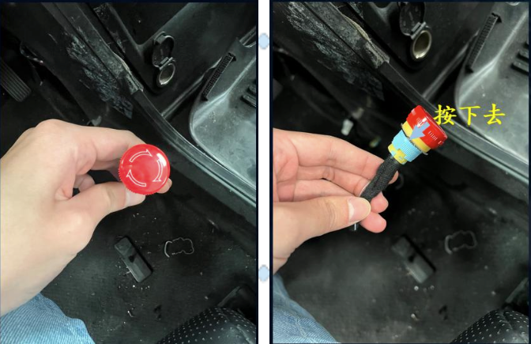
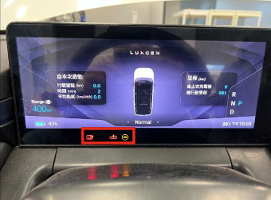
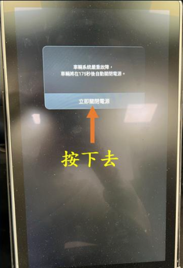
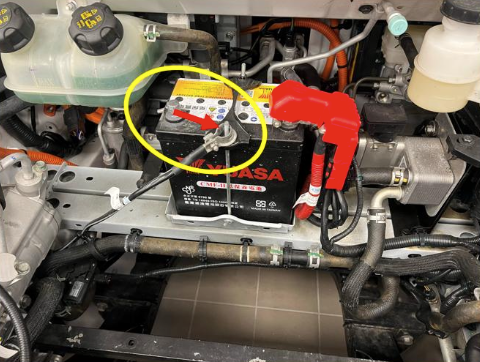
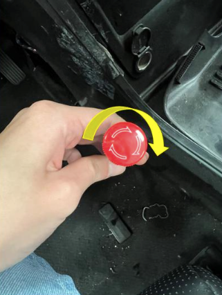

# 8. 紅色緊急按鈕操作方法
- 緊急停止按鈕（紅色）使用說明與注意事項
    - 僅限緊急情況使用，非緊急狀態請勿按下。
    - 本按鈕一旦按下，將切斷車輛高壓主電，車輛動力與部分系統將立即停用，而各車載 ECU 會記錄/拋出 DTC(診斷故障碼)。
- 何時可以按
    - 發生人員傷害風險、設備/車輛失控、起火冒煙或其他立即危害情況。 
    - 教學或測試中出現不可控狀態需立刻中止者。
- 按下後的影響: 
    - 高壓電切斷、動力中止，部分轉向/煞車輔助功能可能受影響。 
    - 各 ECU 會記錄「由急停導致的異常」之 DTC，如不清除，車輛可能維持保護模式而無法驅動或充電。

## 紅色緊急按鈕按下標準操作 SOP
1. 紅色按鈕按下

    

2. 按下後，儀表會亮起框起來的燈號，IVI (In-vehicle Infotainment System) 會出現系統嚴重故障警示，請按下立即關閉電源

    

    

3. 按下立即關閉電源後，待車輛停止後至車輛前方打開引擎蓋，可以看到12V小電池，將電池的負極卸下，如圖所示

    

## 紅色緊急按鈕復歸標準操作 SOP
1. 紅色按鈕復歸，順時針旋轉此按鈕

    

2. 按照 [車輛啟動與連線方式]() 啟動車輛