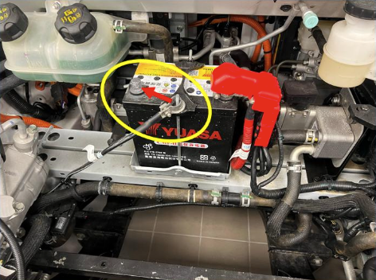
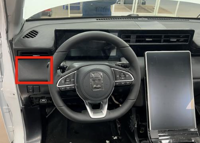
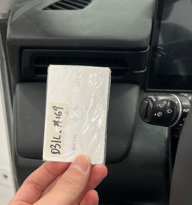
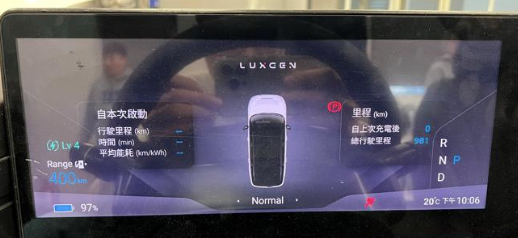

# 4. 車輛啟動與連線方式

本章節介紹如何正確啟動 FoxtronPi 車輛，以及如何透過實體線材與電腦建立連線。

## 4.1 車輛啟動步驟

在開始開發或測試前，請依以下步驟啟動車輛：

### 1. 接上小電源（12V）
接上小電源後需等待 1 分鐘後再進行下列動作

> [!CAUTION]
> 如果是剛卸下小電源負極，請等待30秒的時間才可重新接上，否則車輛無法正常啟動。

{}
- ### 2. 感應區域
    將鑰匙靠近方向盤左側出風口下方的感應區域

    

- ### 3. 卡片靠近感應
    踩下煞車啟動

    

- ### 4. 儀表啟動成功
    當儀表與中控顯示相關燈號與資訊時，即表示車輛已進入啟動狀態，可進行後續操作

    
{}

## 4.2 使用 OBD to RJ45 連線

電腦需透過實體線材與車輛連接，以進行 DoIP 通訊。

### 4.2.1 硬體連接
1. **準備線材**：準備一條專用的 OBD to RJ45 轉接頭/線。
2. **連接車端**：尋找位於駕駛座左下方的 OBD II 接口並插入線材。（是固定在車上的接口，不是懸掛的接口）
3. **連接電腦端**：將線材另一端的 RJ45 接頭插入開發電腦的乙太網路埠（若電腦無網路埠，請使用 USB 乙太網路轉接器）。

### 4.2.2 網路設定
連線建立後，通常無需額外設定電腦的網路環境。若無法與車輛連線，請確認是否接上正確的 OBD 接口。
